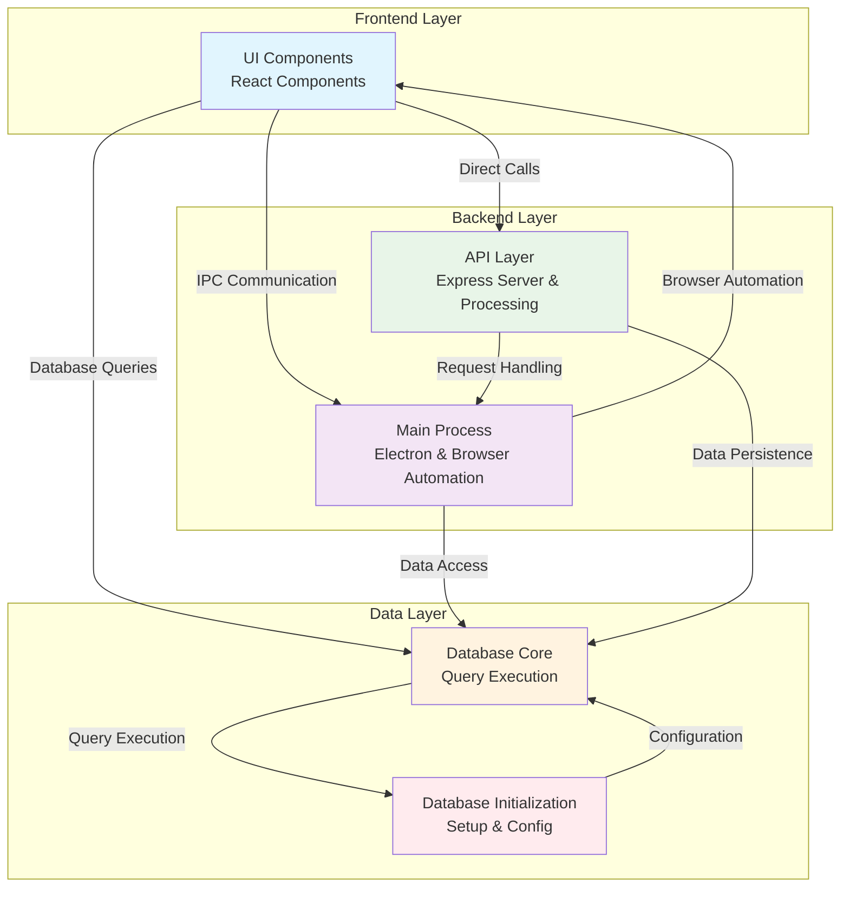

# ChatKey Architecture Documentation

*Generated from GitNexus knowledge graph (indexed: 2026-03-11)*

## Overview

ChatKey is an Electron-based application for managing AI site configurations, processing questions through browser automation, and comparing answers across different AI platforms. The system integrates a React frontend, Node.js/Electron main process, an Express API server, and a MySQL/SQLite database layer.

**Codebase Statistics:**
- **Files:** 51
- **Symbols:** 233 (functions, classes, methods, interfaces)
- **Relationships:** 505 (calls, imports, extends, implements)
- **Functional Areas:** 5 primary clusters
- **Execution Flows:** 20 documented processes

## Functional Areas

GitNexus automatically detected the following functional clusters based on code structure and call patterns:

| Cluster | Members | Description | Key Files |
|---------|---------|-------------|-----------|
| **Main Process** | 31 | Electron main process, browser automation, answer adaptation | `src/main/main.js`, `src/main/browser-automation.js`, `src/main/answer-adapter.js` |
| **UI Components** | 27 | React components for user interface | `src/renderer/src/components/SiteManager.tsx`, `src/renderer/src/components/HistoryManager.tsx`, `src/renderer/src/components/ApiConfig.tsx` |
| **API Layer** | 15 | Express server, question processing, database operations | `src/api/server.js`, `src/main/question-processor.js`, `src/shared/database.js` |
| **Database Core** | 11 | Database query execution and management | `src/shared/database.js` (query methods) |
| **Database Initialization** | 2 | Database setup, migration, configuration | `src/shared/database.js` (constructor, config) |

### Cluster Details

#### Main Process (`Main`)
- **Responsibilities:** Electron window management, browser automation, site-specific answer extraction and adaptation
- **Key Symbols:** `ElectronApp`, `BrowserAutomation`, `SiteAdapter`, `AnswerAdapter`
- **Entry Points:** `createWindow`, `adapt` (browser automation), `handleDeepSeek`, `handleTongyi`

#### UI Components (`Components`)
- **Responsibilities:** User interface for site management, history viewing, API configuration, and answer comparison
- **Key Symbols:** `SiteManager`, `HistoryManager`, `ApiConfig`, `AnswerComparison`
- **Entry Points:** Component render functions, event handlers (`handleToggle`, `loadSites`, `loadHistory`)

#### API Layer (`Api`)
- **Responsibilities:** REST API endpoints, question processing, database interaction facade
- **Key Symbols:** `startApiServer`, `handleChatCompletion`, `processQuestion`, `getAiSites`, `saveQaRecord`
- **Entry Points:** `constructor` (server), `handleChatCompletion`, `processQuestion`

#### Database Core (`Cluster_5`)
- **Responsibilities:** Core database operations, query execution, record management
- **Key Symbols:** `init`, `initSQLite`, `initMySQL`, `createSQLiteTables`, `insertDefaultSites`
- **Entry Points:** `init`, `initSQLite`, `createSQLiteTables`

#### Database Initialization (`Cluster_4`)
- **Responsibilities:** Database connection configuration and setup
- **Key Symbols:** `constructor` (DatabaseManager), `getDbConfig`
- **Entry Points:** `constructor`

## Key Execution Flows

The system implements 20 distinct execution flows. Below are the top 5 most significant processes:

### 1. SiteManager → Execute (6 steps, cross-community)
**Description:** Complete site management flow from UI interaction to database persistence.

**Step-by-Step Trace:**
1. **`SiteManager`** (`src/renderer/src/components/SiteManager.tsx`) – React component renders site management UI
2. **`handleToggle`** (`src/renderer/src/components/SiteManager.tsx`) – User toggles site enabled/disabled
3. **`loadSites`** (`src/renderer/src/components/SiteManager.tsx`) – Load sites from database
4. **`getAiSites`** (`src/shared/database.js`) – Database query to retrieve AI sites
5. **`all`** (`src/shared/database.js`) – Execute SQL query
6. **`execute`** (`src/shared/database.js`) – Final database execution

**Clusters Involved:** Components → Api → Database Core

### 2. App → Execute (5 steps, cross-community)
**Description:** Main application initialization and site loading.

**Step-by-Step Trace:**
1. **`App`** (`src/renderer/src/App.tsx`) – Main React application component
2. **`loadAiSites`** (`src/renderer/src/App.tsx`) – Load AI sites on app startup
3. **`getAiSites`** (`src/shared/database.js`) – Database query
4. **`all`** (`src/shared/database.js`) – Execute SQL
5. **`execute`** (`src/shared/database.js`) – Database execution

**Clusters Involved:** Components → Api → Database Core

### 3. HistoryManager → Execute (5 steps, cross-community)
**Description:** Load and display question/answer history.

**Step-by-Step Trace:**
1. **`HistoryManager`** (`src/renderer/src/components/HistoryManager.tsx`) – History management component
2. **`loadHistory`** (`src/renderer/src/components/HistoryManager.tsx`) – Load history records
3. **`getHistory`** (`src/shared/database.js`) – Database query for history
4. **`all`** (`src/shared/database.js`) – Execute SQL
5. **`execute`** (`src/shared/database.js`) – Database execution

**Clusters Involved:** Components → Database Core

### 4. HandleModalOk → Execute (5 steps, cross-community)
**Description:** Handle modal confirmation for site operations.

**Step-by-Step Trace:**
1. **`handleModalOk`** (`src/renderer/src/components/SiteManager.tsx`) – Modal confirmation handler
2. **`loadSites`** (`src/renderer/src/components/SiteManager.tsx`) – Reload sites after operation
3. **`getAiSites`** (`src/shared/database.js`) – Database query
4. **`all`** (`src/shared/database.js`) – Execute SQL
5. **`execute`** (`src/shared/database.js`) – Database execution

**Clusters Involved:** Components → Api → Database Core

### 5. Init → Execute (5 steps, intra-community)
**Description:** Database initialization and setup.

**Step-by-Step Trace:**
1. **`init`** (`src/shared/database.js`) – Initialize database
2. **`initSQLite`** (`src/shared/database.js`) – SQLite-specific initialization
3. **`insertDefaultSites`** (`src/shared/database.js`) – Insert default AI sites
4. **`all`** (`src/shared/database.js`) – Execute SQL
5. **`execute`** (`src/shared/database.js`) – Database execution

**Clusters Involved:** Database Core (intra-cluster)

## Architecture Diagram

### Diagram Interpretation

1. **Frontend Layer:** React components provide the user interface for site management, history, and configuration.
2. **Backend Layer:** 
   - **Main Process:** Handles Electron window management and browser automation for answer extraction
   - **API Layer:** Processes questions, manages AI site configurations, and serves REST endpoints
3. **Data Layer:**
   - **Database Core:** Executes all database queries and operations
   - **Database Initialization:** Handles database setup, migration, and connection configuration

### Key Data Flows

1. **Site Management:** UI → API → Database Core → Database Initialization
2. **Question Processing:** UI → API → Main Process → Browser Automation → Answer Adaptation
3. **History Viewing:** UI → Database Core
4. **Application Initialization:** Main Process → Database Initialization → Database Core

## System Dependencies

**External Dependencies:**
- **Electron:** Desktop application framework
- **React:** Frontend UI library
- **Express:** API server framework
- **MySQL/SQLite:** Database storage
- **Playwright:** Browser automation for answer extraction

**Internal Dependencies:**
- `src/shared/database.js` is the central data access layer used by all other components
- `src/main/browser-automation.js` contains site-specific adapters for different AI platforms
- `src/renderer/src/components/SiteManager.tsx` is the most complex UI component with 492 lines

## Development Notes

- **Cross-Community Processes:** Most critical flows involve multiple functional areas (e.g., UI → API → Database)
- **Database-Centric:** The Database Core cluster is involved in 15 of 20 execution flows
- **Modularity:** Clear separation between browser automation, UI, API, and data layers
- **Test Coverage:** Playwright tests exist for UI, integration, and automation scenarios

## Recommendations for Future Development

1. **Centralize Database Access:** Consider abstracting database calls through a repository pattern
2. **Strengthen API Boundaries:** Formalize IPC communication between main and renderer processes
3. **Monitor Cross-Cluster Dependencies:** The high connectivity to Database Core suggests it's a critical failure point
4. **Expand Test Coverage:** Focus on cross-community processes where most integration issues occur

---

*This document was automatically generated from the GitNexus knowledge graph. To update, run `npx gitnexus analyze` and regenerate.*